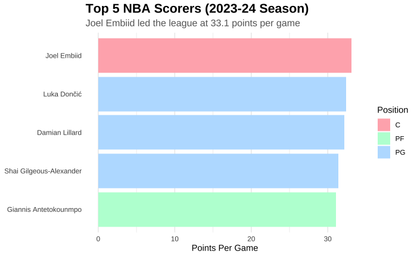
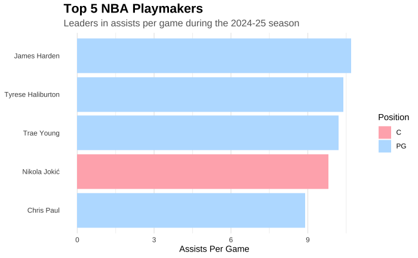
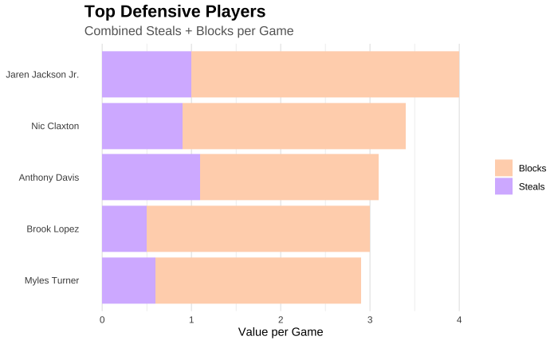
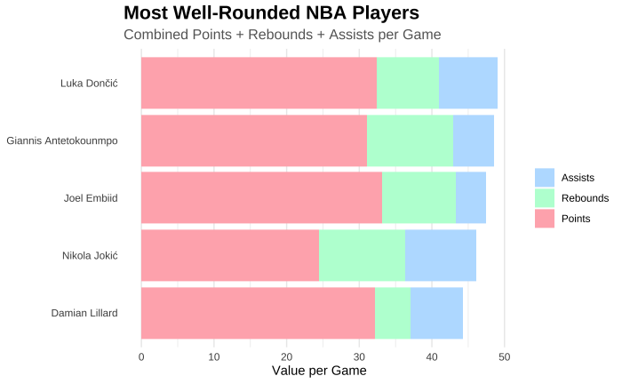

```{r setup, include=FALSE}
knitr::opts_chunk$set(echo = FALSE)
# Learn more about creating websites with Distill at:
# https://rstudio.github.io/distill/website.html
# Learn more about publishing to GitHub Pages at:
# https://rstudio.github.io/distill/publish_website.html#github-pages
```
## Welcome to My Data Visualization Journey
As a student in MATH 230: Data Visualization & Computing, I've explored the art and science of transforming data into meaningful visual stories. This portfolio showcases my growth and accomplishments throughout the semester.

## About Me
I'm Aiden Kim, a Computer Science & Data Science student at Bucknell University with a passion for data analysis and visualization. Through this course, I've developed skills in:
- Statistical visualization techniques
- Interactive dashboard creation
- R programming and RMarkdown
- Data cleaning and preparation
- Principles of effective visual communication

## Featured Project: NBA Elite Player Analysis
My final project explores NBA player performance through the lens of advanced analytics. Using interactive visualizations, I examine questions like:
- How do offensive and defensive metrics correlate across different positions?
- What is the relationship between usage rate and efficiency?
- Which players provide the most value relative to their minutes played?
The dashboard allows users to filter by position, minutes played, and other criteria to perform customized analysis of NBA's elite players.

## Explore My Past Work
- **[Past Work](past_works.html)**: A collection of visualizations created throughout the semester

## NBA Elite Performers: 2023-2024 Season Preview

```{=html}
<style>
.stat-highlight {
  display: flex;
  justify-content: space-around;
  flex-wrap: wrap;
  margin: 30px 0;
  background-color: #17408B; /* NBA blue */
  padding: 20px;
  border-radius: 10px;
  color: white;
}

.stat-box {
  text-align: center;
  padding: 15px;
  background-color: rgba(255,255,255,0.1);
  border-radius: 8px;
  margin: 10px;
  min-width: 180px;
  transition: transform 0.2s ease;
}

.stat-box:hover {
  transform: scale(1.05);
  background-color: rgba(255,255,255,0.2);
}

.stat-number {
  font-size: 2.5rem;
  font-weight: bold;
  margin: 0;
  color: #FFC72C; /* NBA gold */
}

.stat-label {
  font-size: 0.9rem;
  text-transform: uppercase;
  letter-spacing: 1px;
}

.viz-container {
  display: flex;
  flex-direction: column;
  gap: 30px;
  margin-bottom: 40px;
}

.viz-item {
  width: 100%;
  background-color: white;
  border-radius: 10px;
  overflow: hidden;
  box-shadow: 0 4px 6px rgba(0,0,0,0.1);
  transition: transform 0.3s ease;
}

.viz-item:hover {
  transform: translateY(-5px);
  box-shadow: 0 6px 12px rgba(0,0,0,0.15);
}

.viz-img {
  width: 100%;
  max-height: 500px;
  object-fit: contain;
  border-bottom: 1px solid #eee;
}

.viz-content {
  padding: 20px;
}

.viz-title {
  color: #C9082A; /* NBA red */
  margin-top: 0;
  font-size: 1.5rem;
}

.viz-description {
  margin-bottom: 0;
  max-width: 950px;
}

.highlight {
  background-color: #FFC72C; /* NBA gold */
  padding: 2px 4px;
  border-radius: 3px;
  font-weight: bold;
  color: #333;
}

.intro-text {
  text-align: center;
  max-width: 800px;
  margin: 0 auto 30px;
  font-size: 1.1rem;
  line-height: 1.6;
}

.conclusion {
  max-width: 800px;
  margin: 20px auto 40px;
  padding: 20px;
  background-color: #f8f9fa;
  border-radius: 10px;
  box-shadow: 0 2px 4px rgba(0,0,0,0.05);
}
</style>

<div class="intro-text">
  The 2023-2024 NBA season has showcased extraordinary talent across the league. This preview of my final project examines elite performers across different statistical categories, revealing which players have dominated in scoring, playmaking, defense, and all-around contributions.
</div>

<div class="stat-highlight">
  <div class="stat-box">
    <p class="stat-number">33.1</p>
    <p class="stat-label">Points per game by Joel Embiid</p>
  </div>
  <div class="stat-box">
    <p class="stat-number">10.8</p>
    <p class="stat-label">Assists per game by James Harden</p>
  </div>
  <div class="stat-box">
    <p class="stat-number">4.0</p>
    <p class="stat-label">Combined blocks & steals by Jaren Jackson Jr.</p>
  </div>
  <div class="stat-box">
    <p class="stat-number">50+</p>
    <p class="stat-label">Combined PRA by Luka Dončić</p>
  </div>
</div>

<div class="viz-container">
  <!-- Scoring Leaders Visualization -->
  <div class="viz-item">
    
    <div class="viz-content">
      <h3 class="viz-title">Scoring Dominance</h3>
      <p class="viz-description">In the 2023-24 season, <span class="highlight">Joel Embiid</span> led all scorers with an impressive 33.1 points per game, establishing himself as the league's premier offensive threat. What's striking is the positional diversity among the top scorers, with point guards like <span class="highlight">Luka Dončić</span> and <span class="highlight">Damian Lillard</span> matching the scoring output of traditional big men. This reflects the evolution of the modern NBA, where perimeter players are increasingly taking on primary scoring responsibilities.</p>
    </div>
  </div>
  
  <!-- Playmaking Visualization -->
  <div class="viz-item">
    
    <div class="viz-content">
      <h3 class="viz-title">Assist Maestros</h3>
      <p class="viz-description">Playmaking remains dominated by guards, with <span class="highlight">James Harden</span> leading the league at nearly 11 assists per game. The exceptional case is <span class="highlight">Nikola Jokić</span>, the only center among the top playmakers with over 9 assists per game, demonstrating his unique court vision. The narrow distribution of assist numbers (between 8.5-10.8) among these elite passers suggests a consistent threshold for what constitutes elite playmaking in today's NBA.</p>
    </div>
  </div>
  
  <!-- Defensive Leaders Visualization -->
  <div class="viz-item">
    
    <div class="viz-content">
      <h3 class="viz-title">Defensive Disruptors</h3>
      <p class="viz-description">Defensive impact is measured through the combined steals and blocks metric, where <span class="highlight">Jaren Jackson Jr.</span> stands out as the most disruptive force. The visualization reveals different defensive styles: some players like <span class="highlight">Anthony Davis</span> have a more balanced distribution between steals and blocks, while others like <span class="highlight">Brook Lopez</span> specialize predominantly in shot-blocking. This data challenges traditional defensive metrics and provides a more comprehensive view of defensive impact.</p>
    </div>
  </div>
  
  <!-- Well-Rounded Players Visualization -->
  <div class="viz-item">
    
    <div class="viz-content">
      <h3 class="viz-title">Complete Players</h3>
      <p class="viz-description">When combining points, rebounds, and assists, <span class="highlight">Luka Dončić</span> emerges as the most statistically complete player, followed closely by <span class="highlight">Giannis Antetokounmpo</span> and <span class="highlight">Joel Embiid</span>. This visualization reveals the balanced contribution across statistical categories that defines the modern NBA superstar. Notably, all five players contribute significantly in scoring, with varying distributions in rebounding and playmaking based on their position and role within their teams.</p>
    </div>
  </div>
</div>

<div class="conclusion">
  <h3>Key Insights</h3>
  <p>The 2023-24 NBA season data reveals fascinating trends about player performance and position evolution. Centers like Embiid and Jokić are breaking traditional molds by excelling in scoring and playmaking, while versatile forwards and guards are displaying unprecedented statistical breadth. These visualizations are just a preview of my comprehensive final project, which provides interactive tools to explore these patterns in depth.</p>
  <p><strong>Explore the full project: <a href="final_project.html">NBA Elite Player Analysis Dashboard →</a></strong></p>
</div>
```