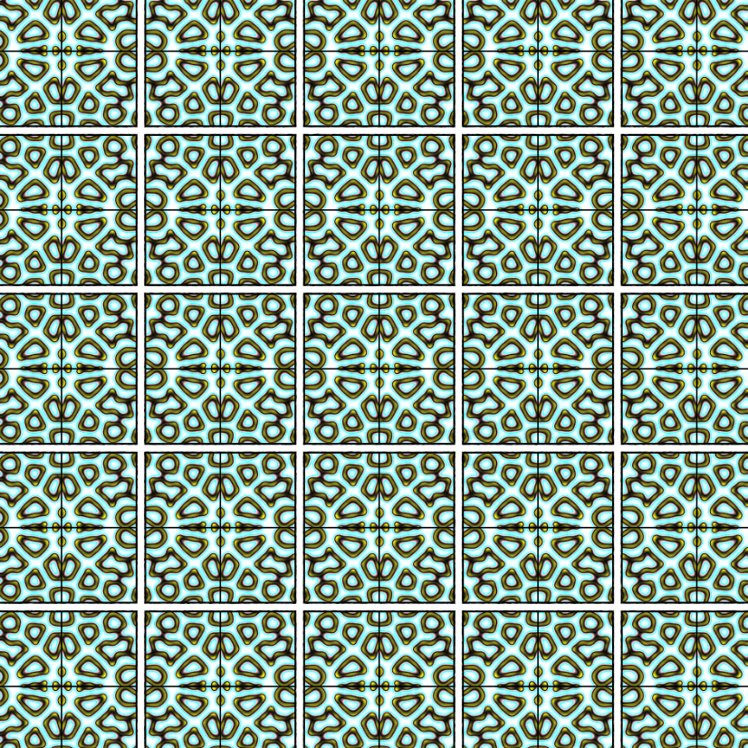
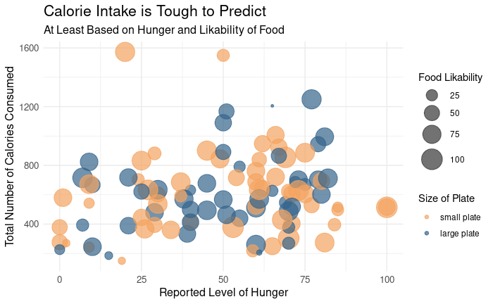
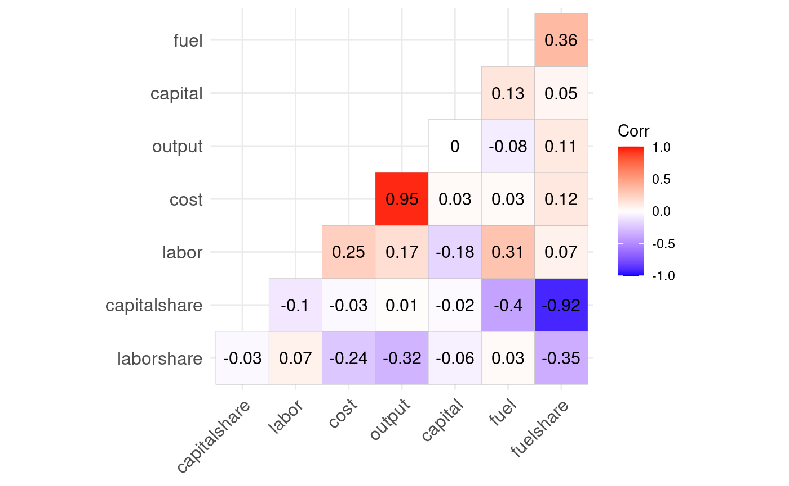
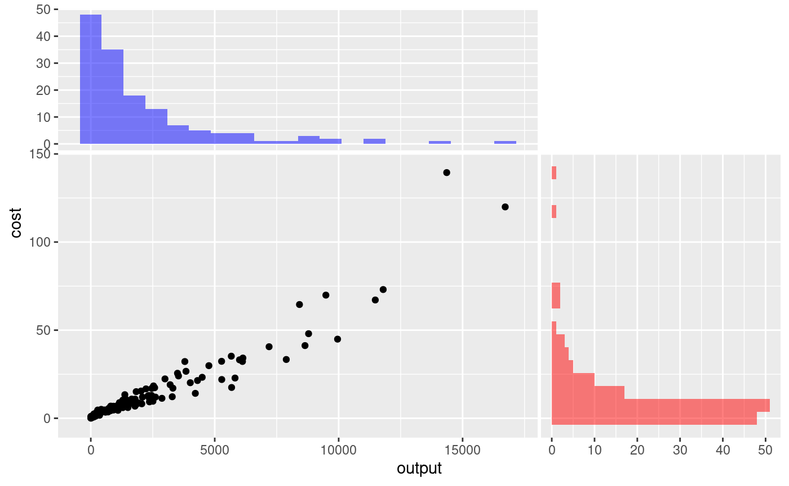

```{r setup, include=FALSE}
knitr::opts_chunk$set(echo = FALSE)
```

## Confidence Levels Dashboard
```{=html}
<div style="width: 100vw; margin-left: calc(-50vw + 50%);">
  <iframe
    src="https://abby-flynt.shinyapps.io/ConfidenceLevels_Dashboard_Team2/"
    width="100%"
    height="800px"
    style="border:none;">
  </iframe>
</div>

<div class="placard">
  <h4>Confidence Levels Dashboard</h4>
  <p><em>Interactive statistical visualization</em></p>
  <p>This dashboard presents statistical confidence levels through an interactive interface, allowing users to explore and understand statistical confidence intervals and their practical applications. The visualization helps demonstrate how sample size, variability, and confidence level interact to determine the precision of statistical estimates, making abstract statistical concepts more accessible and interpretable.</p>
</div>

```


## Generative Artworks
```{=html}
<div style="display: flex; justify-content: space-between; gap: 10px; margin: 20px 0;">
  <div style="width: 32%;">
    
    <div class="placard">
      <h4>Bucknell Theme</h4>
      <p><em>A generative artwork inspired by the Bucknell University color palette and geometric patterns.</em></p>
    </div>
  </div>
  
  <div style="width: 32%;">
    
    <div class="placard">
      <h4>Celestial Chaos</h4>
      <p><em>A generative artwork depicting the dynamic movement and patterns found in cosmic phenomena.</em></p>
    </div>
  </div>
  
  <div style="width: 32%;">
    
    <div class="placard">
      <h4>Fracting Fractals</h4>
      <p><em>A generative artwork exploring recursive geometric patterns and mathematical beauty.</em></p>
    </div>
  </div>
</div>
```

## Data Visualizations
```{=html}
<div style="display: flex; flex-direction: column; gap: 30px; margin: 20px 0;">
  <!-- First Visualization -->
  <div style="width: 100%;">
    
    <div class="placard">
      <h4>CALORIE INTAKE IS TOUGH TO PREDICT</h4>
      <p><em>Food consumption study</em></p>
      <p>This visualization explores the relationship between reported hunger levels (x-axis), total calories consumed (y-axis), food likability (point size), and plate size (point color). The scattered pattern demonstrates that there is no clear linear relationship between hunger and calorie intake, suggesting that psychological and environmental factors like plate size and food preference may play a more significant role in determining how much we eat than physiological hunger alone.</p>
    </div>
  </div>
  
  <!-- Second Visualization -->
  <div style="width: 100%;">
    
    <div class="placard">
      <h4>ECONOMIC FACTOR CORRELATIONS</h4>
      <p><em>Production economics analysis</em></p>
      <p>This correlation heatmap displays the relationships between various economic factors in a production system. The colors represent correlation strength (red for positive, blue for negative) with values shown in each cell. Notable relationships include the strong correlation (0.95) between cost and output, the negative correlation (-0.92) between capitalshare and fuelshare, and moderate positive correlation (0.36) between fuel and fuelshare. This visualization helps identify which economic variables move together and which counteract each other in production systems.</p>
    </div>
  </div>
  
  <!-- Third Visualization -->
  <div style="width: 100%;">
    
    <div class="placard">
      <h4>COST-OUTPUT RELATIONSHIP WITH DISTRIBUTION</h4>
      <p><em>Production cost analysis</em></p>
      <p>This visualization shows the relationship between production output (x-axis) and associated costs (y-axis) with marginal histograms displaying the distribution of each variable. The scatter plot reveals a strong positive correlation between output and cost with an increasingly steep slope at higher output levels, suggesting diseconomies of scale. The histograms show that most production units operate at lower output and cost levels (left-skewed distributions), with fewer units operating at very high output or cost levels.</p>
    </div>
  </div>
</div>
```


```{css, echo=FALSE}
/* Custom CSS for the placards */
.placard {
  background-color: #f8f9fa;
  border-left: 4px solid #0066cc;
  padding: 15px;
  margin-top: 10px;
  margin-bottom: 25px;
  border-radius: 0 4px 4px 0;
}

.placard h4 {
  margin-top: 0;
  color: #0066cc;
}

.placard p:last-child {
  margin-bottom: 0;
}
```
